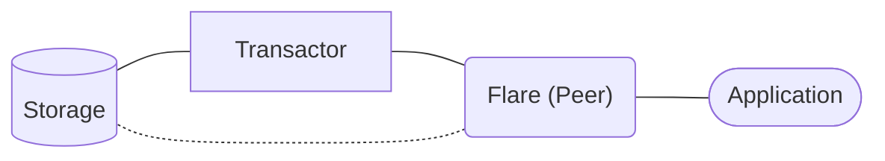
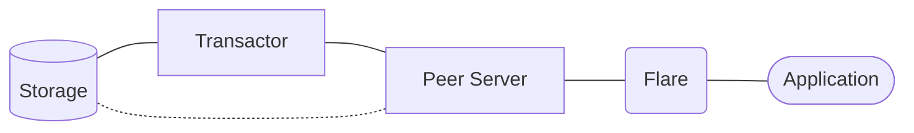
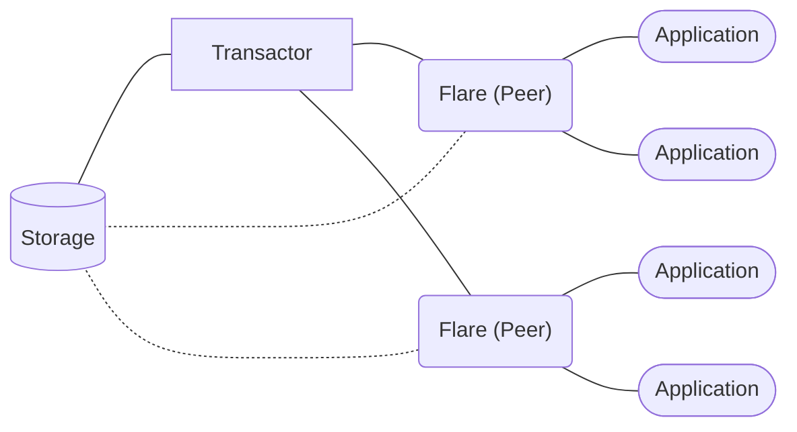
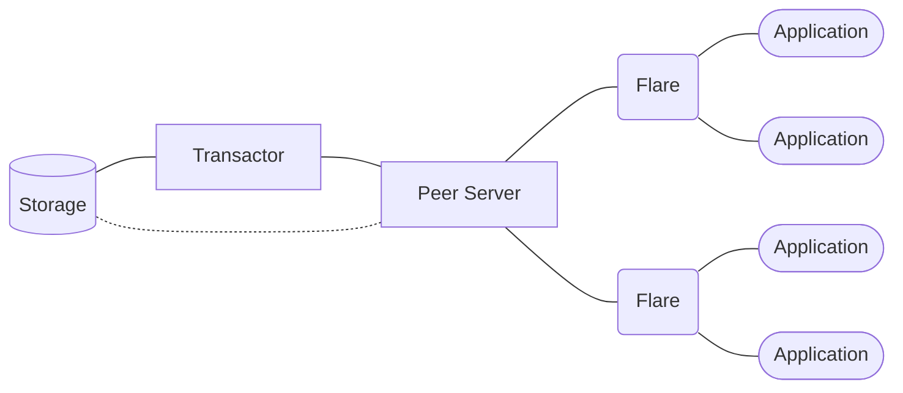
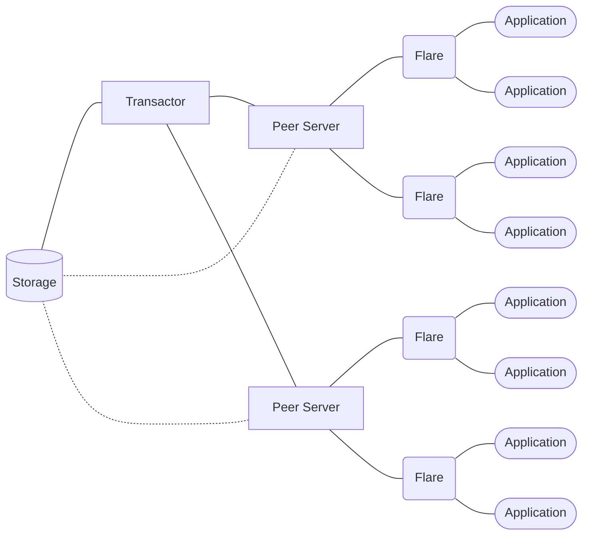

# Flare

A web server that offers an HTTP/JSON API for interacting with [Datomic](https://www.datomic.com) databases.


_This is not an official Datomic project or documentation and it is not affiliated with Datomic in any way._

## TL;DR and Quick Start

Ensure you have [Java](https://clojure.org/guides/install_clojure#java) and [Clojure](https://clojure.org/guides/install_clojure) installed.

```bash
cp .env.example .env
```

```bash
clj -M:run
```

```text
[main] INFO flare.components.server - Starting server on http://0.0.0.0:3042 as peer
```

Ensure you have [curl](https://github.com/curl/curl), [bb](https://github.com/babashka/babashka), and [jq](https://github.com/jqlang/jq) installed.

Transact a Schema:


```bash
echo '
[{:db/ident       :book/title
  :db/valueType   :db.type/string
  :db/cardinality :db.cardinality/one
  :db/doc         "The title of the book."}

 {:db/ident       :book/genre
  :db/valueType   :db.type/string
  :db/cardinality :db.cardinality/one
  :db/doc         "The genre of the book."}]
' \
| bb -e '(pr-str (edn/read-string (slurp *in*)))' \
| curl -s http://localhost:3042/datomic/transact \
  -X POST \
  -H "Content-Type: application/json" \
  --data-binary @- <<JSON \
| jq
{
  "data": $(cat)
}
JSON
```

Assert a Fact:


```bash
echo '
[{:db/id      -1
  :book/title "The Tell-Tale Heart"
  :book/genre "Horror"}]
' \
| bb -e '(pr-str (edn/read-string (slurp *in*)))' \
| curl -s http://localhost:3042/datomic/transact \
  -X POST \
  -H "Content-Type: application/json" \
  --data-binary @- <<JSON \
| jq
{
  "data": $(cat)
}
JSON
```

Read the Data by Querying:


```bash
echo '
[:find ?e ?title ?genre
 :where [?e :book/title ?title]
        [?e :book/genre ?genre]]
' \
| bb -e '(pr-str (edn/read-string (slurp *in*)))' \
| curl -s http://localhost:3042/datomic/q \
  -X GET \
  -H "Content-Type: application/json" \
  --data-binary @- <<JSON \
| jq
{
  "inputs": [
    {
      "database": {
        "latest": true
      }
    }
  ],
  "query": $(cat)
}
JSON
```

```json
{
  "data": [
    [
      4611681620380877802,
      "The Tell-Tale Heart",
      "Horror"
    ]
  ]
}
```


- [TL;DR and Quick Start](#tldr-and-quick-start)
- [Setup](#setup)
  - [Running Datomic](#running-datomic)
  - [Running Flare](#running-flare)
- [Quick Start](#quick-start)
  - [Clojure](#clojure)
  - [Java](#java)
  - [Bash](#bash)
  - [Go](#go)
  - [JavaScript](#javascript)
  - [Node.js](#nodejs)
  - [PHP](#php)
  - [Python](#python)
  - [Ruby](#ruby)
- [Usage](#usage)
  - [Meta](#meta)
  - [Creating a Database](#creating-a-database)
  - [Deleting a Database](#deleting-a-database)
  - [Listing Databases](#listing-databases)
  - [Transacting Schema](#transacting-schema)
  - [Asserting Facts](#asserting-facts)
  - [Reading Data by Entity](#reading-data-by-entity)
  - [Reading Data by Querying](#reading-data-by-querying)
  - [Accumulating Facts](#accumulating-facts)
  - [Retracting Facts](#retracting-facts)
  - [Retrieving Datoms from an Index](#retrieving-datoms-from-an-index)
- [Architecture](#architecture)
  - [Embedded Peers](#embedded-peers)
  - [Peer Servers](#peer-servers)
- [About](#about)
  - [Characteristics](#characteristics)
  - [Trade-offs](#trade-offs)
  - [GET vs. POST](#get-vs-post)
- [Development](#development)

## Setup

### Running Datomic

You can set up Datomic by following its official documentation: [Pro Setup](https://docs.datomic.com/setup/pro-setup.html).

Alternatively, if you have Docker, you can leverage [datomic-pro-docker](https://github.com/gbaptista/datomic-pro-docker).

Clone the repository and copy the Docker Compose template:

```bash
git clone https://github.com/gbaptista/datomic-pro-docker.git

cd datomic-pro-docker

cp compose/datomic-postgresql.yml docker-compose.yml
```

Start PostgreSQL as Datomic's storage service:

```bash
docker compose up -d datomic-storage

docker compose logs -f datomic-storage
```

Create the table for Datomic databases:

```bash
docker compose run datomic-tools psql \
  -f bin/sql/postgres-table.sql \
  -h datomic-storage \
  -U datomic-user \
  -d my-datomic-storage
```

You will be prompted for a password, which is `unsafe`.

Start the Datomic Transactor:

```bash
docker compose up -d datomic-transactor

docker compose logs -f datomic-transactor
```

Create your database named `my-datomic-database`:

```bash
docker compose run datomic-tools clojure -M -e "$(cat <<'CLOJURE'
  (require '[datomic.api :as d])
  (def db-uri "datomic:sql://my-datomic-database?jdbc:postgresql://datomic-storage:5432/my-datomic-storage?user=datomic-user&password=unsafe")
  (d/create-database db-uri)
  (System/exit 0)
CLOJURE
)"
```

Your Datomic database is ready to start using Flare in _Peer Mode_:



If you want to use _Client Mode_, start a Datomic Peer Server:

```bash
docker compose up -d datomic-peer-server

docker compose logs -f datomic-peer-server
```

Your Datomic database is ready to start using Flare in _Client Mode_:



### Running Flare

With [Datomic running](#running-datomic), you are ready to run Flare:

```bash
git clone https://github.com/gbaptista/datomic-flare.git

cd datomic-flare
```

The server can operate in _Peer Mode_, embedding `com.datomic/peer` to establish a _Peer_ directly within the server, or in _Client Mode_, using `com.datomic/client-pro` to connect to a Datomic Peer Server.

Copy the `.env.example` file and fill it with the appropriate information.

```bash
cp .env.example .env
```

If you want _Peer Mode_:
```bash
FLARE_PORT=3042
FLARE_BIND=0.0.0.0

FLARE_MODE=peer

FLARE_PEER_CONNECTION_URI="datomic:sql://my-datomic-database?jdbc:postgresql://localhost:5432/my-datomic-storage?user=datomic-user&password=unsafe"
```

If you want _Client Mode_:
```bash
FLARE_PORT=3042
FLARE_BIND=0.0.0.0

FLARE_MODE=client

FLARE_CLIENT_ENDPOINT=localhost:8998
FLARE_CLIENT_SECRET=unsafe-secret
FLARE_CLIENT_ACCESS_KEY=unsafe-key
FLARE_CLIENT_DATABASE_NAME=my-datomic-database
```

Ensure you have [Java](https://clojure.org/guides/install_clojure#java) and [Clojure](https://clojure.org/guides/install_clojure) installed.

Run the server:

```bash
clj -M:run
```

```text
[main] INFO flare.components.server - Starting server on http://0.0.0.0:3042 as peer
```

Ensure you have [curl](https://github.com/curl/curl), [bb](https://github.com/babashka/babashka), and [jq](https://github.com/jqlang/jq) installed, and you should be able to start firing requests to the server:


```bash
curl -s http://localhost:3042/meta \
  -X GET \
  -H "Content-Type: application/json"  \
| jq
```

```json
{
  "data": {
    "mode": "peer",
    "datomic-flare": "1.0.0",
    "org.clojure/clojure": "1.12.0",
    "com.datomic/peer": "1.0.7187",
    "com.datomic/client-pro": "1.0.81"
  }
}
```

## Quick Start

### Clojure

If you are using Clojure, you already have native access to [Datomic APIs](https://docs.datomic.com/clojure/index.html) and probably should not be using Flare.

### Java

If you are using Java, you already have native access to [Datomic APIs](https://docs.datomic.com/javadoc/datomic/package-summary.html) and probably should not be using Flare.

### Bash

Ensure you have [curl](https://github.com/curl/curl), [bb](https://github.com/babashka/babashka), and [jq](https://github.com/jqlang/jq) installed.

```bash
bash flare.sh
```


```sh
echo '
[{:db/ident       :book/title
  :db/valueType   :db.type/string
  :db/cardinality :db.cardinality/one
  :db/doc         "The title of the book."}

 {:db/ident       :book/genre
  :db/valueType   :db.type/string
  :db/cardinality :db.cardinality/one
  :db/doc         "The genre of the book."}]
' \
| bb -e '(pr-str (edn/read-string (slurp *in*)))' \
| curl -s http://localhost:3042/datomic/transact \
  -X POST \
  -H "Content-Type: application/json" \
  --data-binary @- <<JSON \
| jq
{
  "data": $(cat)
}
JSON

echo '
[{:db/id      -1
  :book/title "The Tell-Tale Heart"
  :book/genre "Horror"}]
' \
| bb -e '(pr-str (edn/read-string (slurp *in*)))' \
| curl -s http://localhost:3042/datomic/transact \
  -X POST \
  -H "Content-Type: application/json" \
  --data-binary @- <<JSON \
| jq
{
  "data": $(cat)
}
JSON

echo '
[:find ?e ?title ?genre
 :where [?e :book/title ?title]
        [?e :book/genre ?genre]]
' \
| bb -e '(pr-str (edn/read-string (slurp *in*)))' \
| curl -s http://localhost:3042/datomic/q \
  -X GET \
  -H "Content-Type: application/json" \
  --data-binary @- <<JSON \
| jq
{
  "inputs": [
    {
      "database": {
        "latest": true
      }
    }
  ],
  "query": $(cat)
}
JSON
```

### Go

```bash
go run flare.go
```


```go
package main

import (
	"bytes"
	"encoding/json"
	"fmt"
	"io/ioutil"
	"net/http"
)

type QueryRequestBody struct {
	Inputs []interface{} `json:"inputs"`
	Query  string        `json:"query,omitempty"`
	Data   string        `json:"data,omitempty"`
}

type DatabaseInput struct {
	Database struct {
		Latest bool `json:"latest"`
	} `json:"database"`
}

func makeRequest(method string, url string, body QueryRequestBody) string {
	jsonBody, _ := json.Marshal(body)

	client := &http.Client{}
	request, _ := http.NewRequest(method, url, bytes.NewBuffer(jsonBody))
	request.Header.Set("Content-Type", "application/json")

	response, _ := client.Do(request)
	defer response.Body.Close()

	responseBody, _ := ioutil.ReadAll(response.Body)

	return string(responseBody)
}

func main() {
	responseBody := makeRequest("POST", "http://localhost:3042/datomic/transact", QueryRequestBody{
		Data: `
			[{:db/ident       :book/title
			  :db/valueType   :db.type/string
			  :db/cardinality :db.cardinality/one
			  :db/doc         "The title of the book."}

			 {:db/ident       :book/genre
			  :db/valueType   :db.type/string
			  :db/cardinality :db.cardinality/one
			  :db/doc         "The genre of the book."}

			 {:db/ident       :book/published_at_year
			  :db/valueType   :db.type/long
			  :db/cardinality :db.cardinality/one
			  :db/doc         "The year the book was published."}]
		`,
	})

	fmt.Println(responseBody)

	responseBody = makeRequest("POST", "http://localhost:3042/datomic/transact", QueryRequestBody{
		Data: `
			[{:db/id      -1
			  :book/title "The Tell-Tale Heart"
			  :book/genre "Horror"
			  :book/published_at_year 1843}]
		`,
	})

	fmt.Println(responseBody)

	responseBody = makeRequest("GET", "http://localhost:3042/datomic/q", QueryRequestBody{
		Inputs: []interface{}{
			DatabaseInput{Database: struct {
				Latest bool `json:"latest"`
			}{Latest: true}},
			"The Tell-Tale Heart",
		},
		Query: `
			[:find ?e ?title ?genre ?year
			 :in $ ?title
			 :where [?e :book/title ?title]
			        [?e :book/genre ?genre]
			        [?e :book/published_at_year ?year]]
		`,
	})

	fmt.Println(responseBody)
}
```

### JavaScript

You can use standard browser APIs like [fetch](https://developer.mozilla.org/en-US/docs/Web/API/Fetch_API). However, it does not accept `GET` requests with a body, so we use `POST` instead. Read more [_about `GET` vs. `POST`_](#get-vs-post).


```js
async function main() {
  let response;

  response = await fetch('http://localhost:3042/datomic/transact', {
    method: 'POST',
    headers: { 'Content-Type': 'application/json' },
    body: JSON.stringify({
      data: `
        [{:db/ident       :book/title
          :db/valueType   :db.type/string
          :db/cardinality :db.cardinality/one
          :db/doc         "The title of the book."}

         {:db/ident       :book/genre
          :db/valueType   :db.type/string
          :db/cardinality :db.cardinality/one
          :db/doc         "The genre of the book."}]
      `
    })
  });

  console.log(await response.json());

  response = await fetch('http://localhost:3042/datomic/transact', {
    method: 'POST',
    headers: { 'Content-Type': 'application/json' },
    body: JSON.stringify({
      data: `
        [{:db/id      -1
          :book/title "The Tell-Tale Heart"
          :book/genre "Horror"}]
      `
    })
  });

  console.log(await response.json());

  response = await fetch('http://localhost:3042/datomic/q', {
    method: 'POST',
    headers: { 'Content-Type': 'application/json' },
    body: JSON.stringify({
      inputs: [
        { database: { latest: true } }
      ],
      query: `
        [:find ?e ?title ?genre
         :where [?e :book/title ?title]
                [?e :book/genre ?genre]]
      `
    })
  });

  console.log(await response.json());
}

main();
```

### Node.js

Create a `package.json` file:

```js
{
  "dependencies": {
    "axios": "^1.7.7"
  }
}
```

```bash
npm install

node flare.js
```


```js
const axios = require('axios');

async function main() {
  let response;

  response = await axios.post('http://localhost:3042/datomic/transact',
    { data: `
        [{:db/ident       :book/title
          :db/valueType   :db.type/string
          :db/cardinality :db.cardinality/one
          :db/doc         "The title of the book."}

         {:db/ident       :book/genre
          :db/valueType   :db.type/string
          :db/cardinality :db.cardinality/one
          :db/doc         "The genre of the book."}]
      `
    },
    { headers: { 'Content-Type': 'application/json' } }
  )


  console.log(response.data);

  response = await axios.post('http://localhost:3042/datomic/transact',
    { data: `
        [{:db/id      -1
          :book/title "The Tell-Tale Heart"
          :book/genre "Horror"}]
      `
    },
    { headers: { 'Content-Type': 'application/json' } }
  );

  console.log(response.data);

  response = await axios.get('http://localhost:3042/datomic/q', {
    headers: { 'Content-Type': 'application/json' },
    data: {
      inputs: [
        { database: { latest: true } }
      ],
      query: `
        [:find ?e ?title ?genre
         :where [?e :book/title ?title]
                [?e :book/genre ?genre]]
      `
    }
  });

  console.log(response.data);
}

main();
```

### PHP

Create a `composer.json` file:

```json
{
  "require": {
    "guzzlehttp/guzzle": "^7.9.2"
  }
}
```

```bash
composer install

php flare.php
```


```php
<?php

require 'vendor/autoload.php';

use GuzzleHttp\Client;

$client = new Client([
  'base_uri' => 'http://localhost:3042',
  'headers'  => ['Content-Type' => 'application/json'],
]);

$response = $client->post('/datomic/transact', [
  'json' => [
    'data' => '
      [{:db/ident       :book/title
        :db/valueType   :db.type/string
        :db/cardinality :db.cardinality/one
        :db/doc         "The title of the book."}

       {:db/ident       :book/genre
        :db/valueType   :db.type/string
        :db/cardinality :db.cardinality/one
        :db/doc         "The genre of the book."}]
    '
  ]
]);

echo $response->getBody();

$response = $client->post('/datomic/transact', [
  'json' => [
    'data' => '
      [{:db/id      -1
        :book/title "The Tell-Tale Heart"
        :book/genre "Horror"}]
    '
  ]
]);

echo $response->getBody();

$response = $client->get('/datomic/q', [
  'json' => [
    'inputs' => [
      ['database' => ['latest' => true]]
    ],
    'query' => '
      [:find ?e ?title ?genre
       :where [?e :book/title ?title]
              [?e :book/genre ?genre]]
    '
  ]
]);

echo $response->getBody();
```

### Python

Create a `requirements.txt` file:

```text
requests ~= 2.32.3
```

```bash
pip install -r requirements.txt

python flare.py
```


```py
import requests

response = requests.post(
    'http://localhost:3042/datomic/transact',
    headers={'Content-Type': 'application/json'},
    json={
        "data": """
        [{:db/ident       :book/title
          :db/valueType   :db.type/string
          :db/cardinality :db.cardinality/one
          :db/doc         "The title of the book."}

         {:db/ident       :book/genre
          :db/valueType   :db.type/string
          :db/cardinality :db.cardinality/one
          :db/doc         "The genre of the book."}]
        """
    }
)

print(response.json())

response = requests.post(
    'http://localhost:3042/datomic/transact',
    headers={'Content-Type': 'application/json'},
    json={
        "data": """
        [{:db/id      -1
          :book/title "The Tell-Tale Heart"
          :book/genre "Horror"}]
        """
    }
)

print(response.json())

response = requests.get(
    'http://localhost:3042/datomic/q',
    headers={'Content-Type': 'application/json'},
    json={
        "inputs": [
            {"database": {"latest": True}}
        ],
        "query": """
        [:find ?e ?title ?genre
         :where [?e :book/title ?title]
                [?e :book/genre ?genre]]
        """
    }
)

print(response.json())
```

### Ruby

You might want to check out the [Flare](https://github.com/gbaptista/ruby-datomic-flare) Ruby Gem.

Create a `Gemfile` file:

```ruby
source 'https://rubygems.org'

gem 'faraday', '~> 2.12'
gem 'faraday-typhoeus', '~> 1.1'
gem 'typhoeus', '~> 1.4', '>= 1.4.1'
```

```bash
bundle

bundle exec ruby flare.rb
```


```rb
require 'json'

require 'faraday'
require 'faraday/typhoeus'

Faraday.default_adapter = :typhoeus

response = Faraday.post('http://localhost:3042/datomic/transact') do |request|
  request.headers['Content-Type'] = 'application/json'
  request.body = {
    data: <<~EDN
      [{:db/ident       :book/title
        :db/valueType   :db.type/string
        :db/cardinality :db.cardinality/one
        :db/doc         "The title of the book."}

       {:db/ident       :book/genre
        :db/valueType   :db.type/string
        :db/cardinality :db.cardinality/one
        :db/doc         "The genre of the book."}]
    EDN
  }.to_json
end

puts response.body

response = Faraday.post('http://localhost:3042/datomic/transact') do |request|
  request.headers['Content-Type'] = 'application/json'
  request.body = {
    data: <<~EDN
      [{:db/id      -1
        :book/title "The Tell-Tale Heart"
        :book/genre "Horror"}]
    EDN
  }.to_json
end

puts response.body

response = Faraday.get('http://localhost:3042/datomic/q') do |request|
  request.headers['Content-Type'] = 'application/json'
  request.body = {
    inputs: [
      { database: { latest: true } }
    ],
    query: <<~EDN
      [:find ?e ?title ?genre
       :where [?e :book/title ?title]
              [?e :book/genre ?genre]]
    EDN
  }.to_json
end

puts response.body
```

## Usage

Ensure you have [curl](https://github.com/curl/curl), [bb](https://github.com/babashka/babashka), and [jq](https://github.com/jqlang/jq) installed.

### Meta


```bash
curl -s http://localhost:3042/meta \
  -X GET \
  -H "Content-Type: application/json"  \
| jq
```

```json
{
  "data": {
    "mode": "peer",
    "datomic-flare": "1.0.0",
    "org.clojure/clojure": "1.12.0",
    "com.datomic/peer": "1.0.7187",
    "com.datomic/client-pro": "1.0.81"
  }
}
```

### Creating a Database

_In Client Mode, this operation is not supported as the Peer Server does not have it available._


```bash
curl -s http://localhost:3042/datomic/create-database \
  -X POST \
  -H "Content-Type: application/json" \
  -d '
{
  "name": "moonlight"
}
' \
| jq
```

```json
{
  "data": true
}
```

### Deleting a Database

_In Client Mode, this operation is not supported as the Peer Server does not have it available._


```bash
curl -s http://localhost:3042/datomic/delete-database \
  -X DELETE \
  -H "Content-Type: application/json" \
  -d '
{
  "name": "moonlight"
}
' \
| jq
```

```json
{
  "data": true
}
```

### Listing Databases

Flare on _Peer Mode_:
```bash
curl -s http://localhost:3042/datomic/get-database-names \
  -X GET \
  -H "Content-Type: application/json"  \
| jq
```

Flare on _Client Mode_:
```bash
curl -s http://localhost:3042/datomic/list-databases \
  -X GET \
  -H "Content-Type: application/json"  \
| jq
```

```json
{
  "data": [
    "my-datomic-database"
  ]
}
```

### Transacting Schema


```bash
echo '
[{:db/ident       :book/title
  :db/valueType   :db.type/string
  :db/cardinality :db.cardinality/one
  :db/doc         "The title of the book."}

 {:db/ident       :book/genre
  :db/valueType   :db.type/string
  :db/cardinality :db.cardinality/one
  :db/doc         "The genre of the book."}

 {:db/ident       :book/published_at_year
  :db/valueType   :db.type/long
  :db/cardinality :db.cardinality/one
  :db/doc         "The year the book was first published."}]
' \
| bb -e '(pr-str (edn/read-string (slurp *in*)))' \
| curl -s http://localhost:3042/datomic/transact \
  -X POST \
  -H "Content-Type: application/json" \
  --data-binary @- <<JSON \
| jq
{
  "data": $(cat)
}
JSON
```

```json
{
  "data": {
    "db-before": "datomic.db.Db@5b93e745",
    "db-after": "datomic.db.Db@1ac7b978",
    "tx-data": [
      [13194139534315, 50, "2024-10-06T13:17:40.354Z", 13194139534315, true],
      [74, 10, ":book/published_at_year", 13194139534315, true],
      [74, 40, 22, 13194139534315, true],
      [74, 41, 35, 13194139534315, true],
      [74, 62, "The year the book was first published.", 13194139534315, true],
      [0, 13, 74, 13194139534315, true]
    ],
    "tempids": {
      "-9223300668110597915": 72,
      "-9223300668110597914": 73,
      "-9223300668110597913": 74
    }
  }
}
```

### Asserting Facts


```bash
echo '
[{:db/id      -1
  :book/title "Pride and Prejudice"
  :book/genre "Romance"
  :book/published_at_year 1813}]
' \
| bb -e '(pr-str (edn/read-string (slurp *in*)))' \
| curl -s http://localhost:3042/datomic/transact \
  -X POST \
  -H "Content-Type: application/json" \
  --data-binary @- <<JSON \
| jq
{
  "data": $(cat)
}
JSON
```

```json
{
  "data": {
    "db-before": "datomic.db.Db@303b5f6d",
    "db-after": "datomic.db.Db@6266e1f2",
    "tx-data": [
      [13194139534316, 50, "2024-10-06T13:17:40.374Z", 13194139534316, true],
      [4611681620380877805, 72, "Pride and Prejudice", 13194139534316, true],
      [4611681620380877805, 73, "Romance", 13194139534316, true],
      [4611681620380877805, 74, 1813, 13194139534316, true]
    ],
    "tempids": {
      "-1": 4611681620380877805
    }
  }
}
```


```bash
echo '
[{:db/id      -1
  :book/title "Near to the Wild Heart"
  :book/genre "Novel"
  :book/published_at_year 1943}
 {:db/id      -2
  :book/title "A Study in Scarlet"
  :book/genre "Detective"
  :book/published_at_year 1887}
 {:db/id      -3
  :book/title "The Tell-Tale Heart"
  :book/genre "Horror"
  :book/published_at_year 1843}]
' \
| bb -e '(pr-str (edn/read-string (slurp *in*)))' \
| curl -s http://localhost:3042/datomic/transact \
  -X POST \
  -H "Content-Type: application/json" \
  --data-binary @- <<JSON \
| jq
{
  "data": $(cat)
}
JSON
```

```json
{
  "data": {
    "db-before": "datomic.db.Db@615fa61a",
    "db-after": "datomic.db.Db@46f4cf30",
    "tx-data": [
      [13194139534318, 50, "2024-10-06T13:17:40.397Z", 13194139534318, true],
      [4611681620380877807, 72, "Near to the Wild Heart", 13194139534318, true],
      [4611681620380877807, 73, "Novel", 13194139534318, true],
      [4611681620380877807, 74, 1943, 13194139534318, true],
      [4611681620380877808, 72, "A Study in Scarlet", 13194139534318, true],
      [4611681620380877808, 73, "Detective", 13194139534318, true],
      [4611681620380877808, 74, 1887, 13194139534318, true],
      [4611681620380877809, 72, "The Tell-Tale Heart", 13194139534318, true],
      [4611681620380877809, 73, "Horror", 13194139534318, true],
      [4611681620380877809, 74, 1843, 13194139534318, true]
    ],
    "tempids": {
      "-1": 4611681620380877807,
      "-2": 4611681620380877808,
      "-3": 4611681620380877809
    }
  }
}
```

### Reading Data by Entity

_In Client Mode, this operation is not supported as the Peer Server does not have it available._


```bash
curl -s http://localhost:3042/datomic/entity \
  -X GET \
  -H "Content-Type: application/json" \
  -d '
{
  "database": {
    "latest": true
  },
  "id": 4611681620380877807
}
' \
| jq
```

```json
{
  "data": {
    ":book/title": "Near to the Wild Heart",
    ":book/genre": "Novel",
    ":book/published_at_year": 1943,
    ":db/id": 4611681620380877807
  }
}
```

### Reading Data by Querying


```bash
echo '
[:find ?e ?title ?genre ?year
 :where [?e :book/title ?title]
        [?e :book/genre ?genre]
        [?e :book/published_at_year ?year]]
' \
| bb -e '(pr-str (edn/read-string (slurp *in*)))' \
| curl -s http://localhost:3042/datomic/q \
  -X GET \
  -H "Content-Type: application/json" \
  --data-binary @- <<JSON \
| jq
{
  "inputs": [
    {
      "database": {
        "latest": true
      }
    }
  ],
  "query": $(cat)
}
JSON
```

```json
{
  "data": [
    [
      4611681620380877808,
      "A Study in Scarlet",
      "Detective",
      1887
    ],
    [
      4611681620380877807,
      "Near to the Wild Heart",
      "Novel",
      1943
    ],
    [
      4611681620380877809,
      "The Tell-Tale Heart",
      "Horror",
      1843
    ],
    [
      4611681620380877805,
      "Pride and Prejudice",
      "Romance",
      1813
    ]
  ]
}
```


```bash
echo '
[:find ?e ?title ?genre ?year
 :in $ ?title
 :where [?e :book/title ?title]
        [?e :book/genre ?genre]
        [?e :book/published_at_year ?year]]
' \
| bb -e '(pr-str (edn/read-string (slurp *in*)))' \
| curl -s http://localhost:3042/datomic/q \
  -X GET \
  -H "Content-Type: application/json" \
  --data-binary @- <<JSON \
| jq
{
  "inputs": [
    {
      "database": {
        "latest": true
      }
    },
    "The Tell-Tale Heart"
  ],
  "query": $(cat)
}
JSON
```

```json
{
  "data": [
    [
      4611681620380877809,
      "The Tell-Tale Heart",
      "Horror",
      1843
    ]
  ]
}
```

### Accumulating Facts


```bash
echo '
[{:db/id 4611681620380877806 :book/genre "Gothic"}]
' \
| bb -e '(pr-str (edn/read-string (slurp *in*)))' \
| curl -s http://localhost:3042/datomic/transact \
  -X POST \
  -H "Content-Type: application/json" \
  --data-binary @- <<JSON \
| jq
{
  "data": $(cat)
}
JSON
```

```json
{
  "data": {
    "db-before": "datomic.db.Db@2c5e30b4",
    "db-after": "datomic.db.Db@79622dbc",
    "tx-data": [
      [13194139534322, 50, "2024-10-06T13:17:40.479Z", 13194139534322, true],
      [4611681620380877806, 73, "Gothic", 13194139534322, true]
    ],
    "tempids": {
    }
  }
}
```

### Retracting Facts

Retract the value of an attribute:


```bash
echo '
[[:db/retract 4611681620380877806 :book/genre "Gothic"]]
' \
| bb -e '(pr-str (edn/read-string (slurp *in*)))' \
| curl -s http://localhost:3042/datomic/transact \
  -X POST \
  -H "Content-Type: application/json" \
  --data-binary @- <<JSON \
| jq
{
  "data": $(cat)
}
JSON
```

```json
{
  "data": {
    "db-before": "datomic.db.Db@65113bfc",
    "db-after": "datomic.db.Db@57cf521",
    "tx-data": [
      [13194139534323, 50, "2024-10-06T13:17:40.497Z", 13194139534323, true],
      [4611681620380877806, 73, "Gothic", 13194139534323, false]
    ],
    "tempids": {
    }
  }
}
```

Retract an attribute:


```bash
echo '
[[:db/retract 4611681620380877804 :book/genre]]
' \
| bb -e '(pr-str (edn/read-string (slurp *in*)))' \
| curl -s http://localhost:3042/datomic/transact \
  -X POST \
  -H "Content-Type: application/json" \
  --data-binary @- <<JSON \
| jq
{
  "data": $(cat)
}
JSON
```

```json
{
  "data": {
    "db-before": "datomic.db.Db@587aaeaa",
    "db-after": "datomic.db.Db@301d67d4",
    "tx-data": [
      [13194139534324, 50, "2024-10-06T13:17:40.533Z", 13194139534324, true]
    ],
    "tempids": {
    }
  }
}
```

Retract an entity:


```bash
echo '
[[:db/retractEntity 4611681620380877805]]
' \
| bb -e '(pr-str (edn/read-string (slurp *in*)))' \
| curl -s http://localhost:3042/datomic/transact \
  -X POST \
  -H "Content-Type: application/json" \
  --data-binary @- <<JSON \
| jq
{
  "data": $(cat)
}
JSON
```

```json
{
  "data": {
    "db-before": "datomic.db.Db@5c3f74f0",
    "db-after": "datomic.db.Db@3e8847ab",
    "tx-data": [
      [13194139534325, 50, "2024-10-06T13:17:40.551Z", 13194139534325, true],
      [4611681620380877805, 72, "Pride and Prejudice", 13194139534325, false],
      [4611681620380877805, 73, "Romance", 13194139534325, false],
      [4611681620380877805, 74, 1813, 13194139534325, false]
    ],
    "tempids": {
    }
  }
}
```

### Retrieving Datoms from an Index


```bash
curl -s http://localhost:3042/datomic/datoms \
  -X GET \
  -H "Content-Type: application/json" \
  -d '
{
  "database": {
    "latest": true
  },
  "index": "eavt"
}
' \
| jq
```

```json
{
  "data": [
    [0, 10, "db", 0, true],
    [0, 11, 0, 54, true],
    [0, 11, 3, 0, true],
    [0, 11, 4, 0, true]
  ]
}
```

## Architecture

Here are samples of how you may deploy Flare in your infrastructure.

### Embedded Peers




### Peer Servers






## About

### Characteristics

- Languages that play well with HTTP and JSON can interact with Datomic right away;

- Plug and play into any of the many flavors of Datomic's flexible infrastructure architecture;

- Minimal and transparent layer, not a DSL or framework, just straightforward access to Datomic;

- Despite JSON, both queries and transactions are done in [edn](https://github.com/edn-format/edn), enabling, e.g., powerful [Datalog](https://www.learndatalogtoday.org) queries.

### Trade-offs

- Languages have different data types, so edn -> JSON -> [Your Language] and vice-versa: something will be lost in translation and expressiveness;

- An extra layer in the architecture adds a new hop to requests, potentially increasing latency;

- Being one step away from Clojure reduces our power to fully leverage its types, data structures, immutability, and other desired properties;

- Some tricks that would be easy to do in Clojure + Datomic become more cumbersome: transaction functions, advanced Datalog datasources, lazy loading, etc.

### GET vs. POST

This API offers `GET` endpoints that accept a JSON body, an approach used by projects like [Elasticsearch](https://www.elastic.co/guide/en/elasticsearch/reference/current/query-dsl-query-string-query.html).

If you encounter issues, switch from `GET` to `POST`. The server will mirror the behavior of the `GET` requests.

Semantically, `GET` should [not have bodies](https://www.rfc-editor.org/rfc/rfc7231#section-4.3.1). Semantically, `POST` implies side effects, which is not the case here. So, we are aware that both are not ideal.

We considered using query strings with `GET`, but parsing was cumbersome and length limits were a risk, so we use `GET` with a body and `POST` as a fallback.

Future HTTP evolutions may address this use case, such as the proposed HTTP [`QUERY`](https://datatracker.ietf.org/doc/draft-ietf-httpbis-safe-method-w-body/) method.

## Development

```bash
clj -M:run
```

```bash
clj -M:repl
```

```bash
clj -M:format
clj -M:lint
```

```bash
cljfmt fix deps.edn src/
clj-kondo --lint deps.edn src/
```
