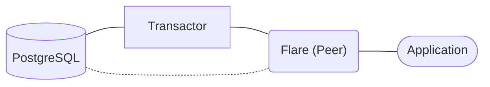
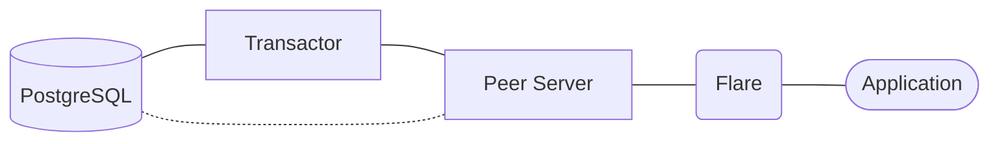
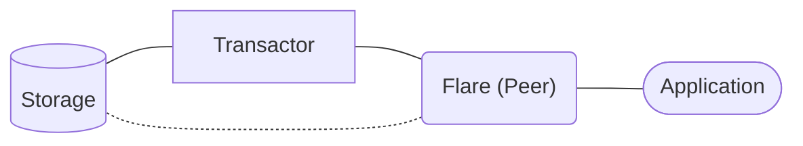
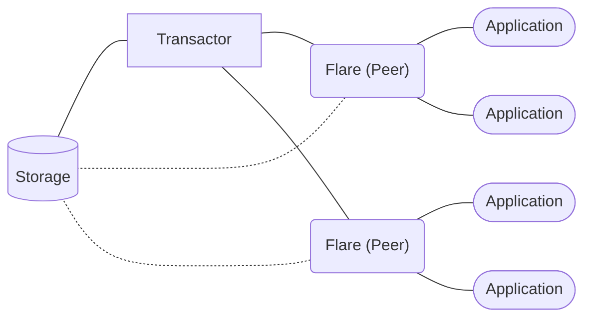
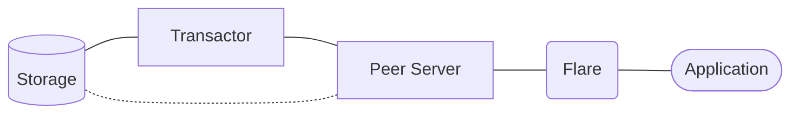
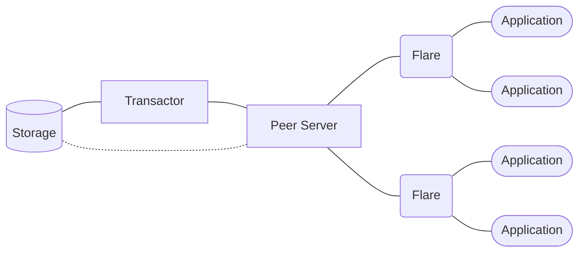
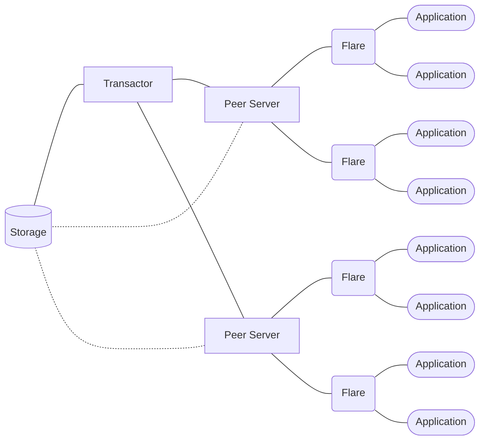

# Datomic Flare

A web server that offers an HTTP/JSON API for interacting with [Datomic](https://www.datomic.com) databases.


_This is not an official Datomic project or documentation and it is not affiliated with Datomic in any way._

## TL;DR and Quick Start

Ensure you have [Java](https://clojure.org/guides/install_clojure#java) and [Clojure](https://clojure.org/guides/install_clojure) installed.

```bash
cp .env.example .env
```

```bash
clj -M:run
```

```text
[main] INFO flare.components.server - Starting server on http://0.0.0.0:3042 as peer
```

Ensure you have [curl](https://github.com/curl/curl), [bb](https://github.com/babashka/babashka), and [jq](https://github.com/jqlang/jq) installed.

Transact a Schema:


```bash
echo '
[{:db/ident       :book/title
  :db/valueType   :db.type/string
  :db/cardinality :db.cardinality/one
  :db/doc         "The title of the book."}

 {:db/ident       :book/genre
  :db/valueType   :db.type/string
  :db/cardinality :db.cardinality/one
  :db/doc         "The genre of the book."}]
' \
| bb -e '(pr-str (edn/read-string (slurp *in*)))' \
| curl -s http://localhost:3042/datomic/transact \
  -X POST \
  -H "Content-Type: application/json" \
  --data-binary @- <<JSON \
| jq
{
  "data": $(cat)
}
JSON
```

Assert a Fact:


```bash
echo '
[{:db/id      -1
  :book/title "The Tell-Tale Heart"
  :book/genre "Horror"}]
' \
| bb -e '(pr-str (edn/read-string (slurp *in*)))' \
| curl -s http://localhost:3042/datomic/transact \
  -X POST \
  -H "Content-Type: application/json" \
  --data-binary @- <<JSON \
| jq
{
  "data": $(cat)
}
JSON
```

Read the Data by Querying:


```bash
echo '
[:find ?e ?title ?genre
 :where [?e :book/title ?title]
        [?e :book/genre ?genre]]
' \
| bb -e '(pr-str (edn/read-string (slurp *in*)))' \
| curl -s http://localhost:3042/datomic/q \
  -X GET \
  -H "Content-Type: application/json" \
  --data-binary @- <<JSON \
| jq
{
  "inputs": [
    {
      "database": {
        "latest": true
      }
    }
  ],
  "query": $(cat)
}
JSON
```

```json
{
  "data": [
    [
      4611681620380877802,
      "The Tell-Tale Heart",
      "Horror"
    ]
  ]
}
```


{{ index }}

## Setup

### Running Datomic

You can set up Datomic by following its official documentation: [Pro Setup](https://docs.datomic.com/setup/pro-setup.html).

Alternatively, if you have Docker, you can leverage [datomic-pro-docker](https://github.com/gbaptista/datomic-pro-docker).

Clone the repository and copy the Docker Compose template:

```bash
git clone https://github.com/gbaptista/datomic-pro-docker.git

cd datomic-pro-docker

cp compose/postgresql.yml docker-compose.yml
```

Start PostgreSQL as Datomic's storage service:

```bash
docker compose up -d datomic-storage

docker compose logs -f datomic-storage
```

Create the table for Datomic databases:

```bash
docker compose run datomic-tools psql \
  -f bin/sql/postgres-table.sql \
  -h datomic-storage \
  -U datomic-user \
  -d my-datomic-storage
```

You will be prompted for a password, which is `unsafe`.

Start the Datomic Transactor:

```bash
docker compose up -d datomic-transactor

docker compose logs -f datomic-transactor
```

Create your database named `my-datomic-database`:

```bash
docker compose run datomic-tools clojure -M -e "$(cat <<'CLOJURE'
  (require '[datomic.api :as d])
  (def db-uri "datomic:sql://my-datomic-database?jdbc:postgresql://datomic-storage:5432/my-datomic-storage?user=datomic-user&password=unsafe")
  (d/create-database db-uri)
  (System/exit 0)
CLOJURE
)"
```

Your Datomic database is ready to start using Flare in _Peer Mode_:



If you want to use _Client Mode_, start a Datomic Peer Server:

```bash
docker compose up -d datomic-peer-server

docker compose logs -f datomic-peer-server
```

Your Datomic database is ready to start using Flare in _Client Mode_:



### Running Flare

With [Datomic running](#running-datomic), you are ready to run Flare:

```bash
git clone https://github.com/gbaptista/datomic-flare.git

cd datomic-flare
```

The server can operate in _Peer Mode_, embedding `com.datomic/peer` to establish a _Peer_ directly within the server, or in _Client Mode_, using `com.datomic/client-pro` to connect to a Datomic Peer Server.

Copy the `.env.example` file and fill it with the appropriate information.

```bash
cp .env.example .env
```

If you want _Peer Mode_:
```bash
FLARE_PORT=3042
FLARE_BIND=0.0.0.0

FLARE_MODE=peer

FLARE_PEER_CONNECTION_URI="datomic:sql://my-datomic-database?jdbc:postgresql://localhost:5432/my-datomic-storage?user=datomic-user&password=unsafe"
```

If you want _Client Mode_:
```bash
FLARE_PORT=3042
FLARE_BIND=0.0.0.0

FLARE_MODE=client

FLARE_CLIENT_ENDPOINT=localhost:8998
FLARE_CLIENT_SECRET=unsafe-secret
FLARE_CLIENT_ACCESS_KEY=unsafe-key
FLARE_CLIENT_DATABASE_NAME=my-datomic-database
```

Ensure you have [Java](https://clojure.org/guides/install_clojure#java) and [Clojure](https://clojure.org/guides/install_clojure) installed.

Run the server:

```bash
clj -M:run
```

```text
[main] INFO flare.components.server - Starting server on http://0.0.0.0:3042 as peer
```

Ensure you have [curl](https://github.com/curl/curl), [bb](https://github.com/babashka/babashka), and [jq](https://github.com/jqlang/jq) installed, and you should be able to start firing requests to the server:


```bash
curl -s http://localhost:3042/meta \
  -X GET \
  -H "Content-Type: application/json"  \
| jq
```

```json
{
  "data": {
    "mode": "peer",
    "datomic-flare": "1.0.0",
    "org.clojure/clojure": "1.12.0",
    "com.datomic/peer": "1.0.7187",
    "com.datomic/client-pro": "1.0.81"
  }
}
```

## Quick Start

### Clojure

If you are using Clojure, you already have native access to [Datomic APIs](https://docs.datomic.com/clojure/index.html) and probably should not be using Flare.

### Java

If you are using Java, you already have native access to [Datomic APIs](https://docs.datomic.com/javadoc/datomic/package-summary.html) and probably should not be using Flare.

{{ quick_starts }}

## Usage

Ensure you have [curl](https://github.com/curl/curl), [bb](https://github.com/babashka/babashka), and [jq](https://github.com/jqlang/jq) installed.

### Meta


```bash
curl -s http://localhost:3042/meta \
  -X GET \
  -H "Content-Type: application/json"  \
| jq
```

```json
{
  "data": {
    "mode": "peer",
    "datomic-flare": "1.0.0",
    "org.clojure/clojure": "1.12.0",
    "com.datomic/peer": "1.0.7187",
    "com.datomic/client-pro": "1.0.81"
  }
}
```

### Creating a Database

_In Client Mode, this operation is not supported as the Peer Server does not have it available._


```bash
curl -s http://localhost:3042/datomic/create-database \
  -X POST \
  -H "Content-Type: application/json" \
  -d '
{
  "name": "moonlight"
}
' \
| jq
```

```json
{
  "data": true
}
```

### Deleting a Database

_In Client Mode, this operation is not supported as the Peer Server does not have it available._


```bash
curl -s http://localhost:3042/datomic/delete-database \
  -X DELETE \
  -H "Content-Type: application/json" \
  -d '
{
  "name": "moonlight"
}
' \
| jq
```

```json
{
  "data": true
}
```

### Listing Databases

Flare on _Peer Mode_:
```bash
curl -s http://localhost:3042/datomic/get-database-names \
  -X GET \
  -H "Content-Type: application/json"  \
| jq
```

Flare on _Client Mode_:
```bash
curl -s http://localhost:3042/datomic/list-databases \
  -X GET \
  -H "Content-Type: application/json"  \
| jq
```

```json
{
  "data": [
    "my-datomic-database"
  ]
}
```

### Transacting Schema


```bash
echo '
[{:db/ident       :book/title
  :db/valueType   :db.type/string
  :db/cardinality :db.cardinality/one
  :db/doc         "The title of the book."}

 {:db/ident       :book/genre
  :db/valueType   :db.type/string
  :db/cardinality :db.cardinality/one
  :db/doc         "The genre of the book."}

 {:db/ident       :book/published_at_year
  :db/valueType   :db.type/long
  :db/cardinality :db.cardinality/one
  :db/doc         "The year the book was first published."}]
' \
| bb -e '(pr-str (edn/read-string (slurp *in*)))' \
| curl -s http://localhost:3042/datomic/transact \
  -X POST \
  -H "Content-Type: application/json" \
  --data-binary @- <<JSON \
| jq
{
  "data": $(cat)
}
JSON
```

```json
{
  "data": {
    "db-before": "datomic.db.Db@321b1b31",
    "db-after": "datomic.db.Db@5b98d113",
    "tx-data": [
      [13194139534315, 50, "2024-09-29T14:29:23.230Z", 13194139534315, true],
      [74, 10, ":book/published_at_year", 13194139534315, true],
      [74, 40, 22, 13194139534315, true],
      [74, 41, 35, 13194139534315, true],
      [74, 62, "The year the book was first published.", 13194139534315, true],
      [0, 13, 74, 13194139534315, true]
    ],
    "tempids": {
      "-9223300668110558576": 72,
      "-9223300668110558575": 73,
      "-9223300668110558574": 74
    }
  }
}
```

### Asserting Facts


```bash
echo '
[{:db/id      -1
  :book/title "Pride and Prejudice"
  :book/genre "Romance"
  :book/published_at_year 1813}]
' \
| bb -e '(pr-str (edn/read-string (slurp *in*)))' \
| curl -s http://localhost:3042/datomic/transact \
  -X POST \
  -H "Content-Type: application/json" \
  --data-binary @- <<JSON \
| jq
{
  "data": $(cat)
}
JSON
```

```json
{
  "data": {
    "db-before": "datomic.db.Db@555f2410",
    "db-after": "datomic.db.Db@5160ba63",
    "tx-data": [
      [13194139534316, 50, "2024-09-29T14:29:23.245Z", 13194139534316, true],
      [4611681620380877805, 72, "Pride and Prejudice", 13194139534316, true],
      [4611681620380877805, 73, "Romance", 13194139534316, true],
      [4611681620380877805, 74, 1813, 13194139534316, true]
    ],
    "tempids": {
      "-1": 4611681620380877805
    }
  }
}
```


```bash
echo '
[{:db/id      -1
  :book/title "Near to the Wild Heart"
  :book/genre "Novel"
  :book/published_at_year 1943}
 {:db/id      -2
  :book/title "A Study in Scarlet"
  :book/genre "Detective"
  :book/published_at_year 1887}
 {:db/id      -3
  :book/title "The Tell-Tale Heart"
  :book/genre "Horror"
  :book/published_at_year 1843}]
' \
| bb -e '(pr-str (edn/read-string (slurp *in*)))' \
| curl -s http://localhost:3042/datomic/transact \
  -X POST \
  -H "Content-Type: application/json" \
  --data-binary @- <<JSON \
| jq
{
  "data": $(cat)
}
JSON
```

```json
{
  "data": {
    "db-before": "datomic.db.Db@14622e2b",
    "db-after": "datomic.db.Db@9ef65fd",
    "tx-data": [
      [13194139534318, 50, "2024-09-29T14:29:23.262Z", 13194139534318, true],
      [4611681620380877807, 72, "Near to the Wild Heart", 13194139534318, true],
      [4611681620380877807, 73, "Novel", 13194139534318, true],
      [4611681620380877807, 74, 1943, 13194139534318, true],
      [4611681620380877808, 72, "A Study in Scarlet", 13194139534318, true],
      [4611681620380877808, 73, "Detective", 13194139534318, true],
      [4611681620380877808, 74, 1887, 13194139534318, true],
      [4611681620380877809, 72, "The Tell-Tale Heart", 13194139534318, true],
      [4611681620380877809, 73, "Horror", 13194139534318, true],
      [4611681620380877809, 74, 1843, 13194139534318, true]
    ],
    "tempids": {
      "-1": 4611681620380877807,
      "-2": 4611681620380877808,
      "-3": 4611681620380877809
    }
  }
}
```

### Reading Data by Entity

_In Client Mode, this operation is not supported as the Peer Server does not have it available._


```bash
curl -s http://localhost:3042/datomic/entity \
  -X GET \
  -H "Content-Type: application/json" \
  -d '
{
  "database": {
    "latest": true
  },
  "id": 4611681620380877807
}
' \
| jq
```

```json
{
  "data": {
    ":book/title": "Near to the Wild Heart",
    ":book/genre": "Novel",
    ":book/published_at_year": 1943,
    ":db/id": 4611681620380877807
  }
}
```

### Reading Data by Querying


```bash
echo '
[:find ?e ?title ?genre ?year
 :where [?e :book/title ?title]
        [?e :book/genre ?genre]
        [?e :book/published_at_year ?year]]
' \
| bb -e '(pr-str (edn/read-string (slurp *in*)))' \
| curl -s http://localhost:3042/datomic/q \
  -X GET \
  -H "Content-Type: application/json" \
  --data-binary @- <<JSON \
| jq
{
  "inputs": [
    {
      "database": {
        "latest": true
      }
    }
  ],
  "query": $(cat)
}
JSON
```

```json
{
  "data": [
    [
      4611681620380877808,
      "A Study in Scarlet",
      "Detective",
      1887
    ],
    [
      4611681620380877807,
      "Near to the Wild Heart",
      "Novel",
      1943
    ],
    [
      4611681620380877809,
      "The Tell-Tale Heart",
      "Horror",
      1843
    ],
    [
      4611681620380877805,
      "Pride and Prejudice",
      "Romance",
      1813
    ]
  ]
}
```


```bash
echo '
[:find ?e ?title ?genre ?year
 :in $ ?title
 :where [?e :book/title ?title]
        [?e :book/genre ?genre]
        [?e :book/published_at_year ?year]]
' \
| bb -e '(pr-str (edn/read-string (slurp *in*)))' \
| curl -s http://localhost:3042/datomic/q \
  -X GET \
  -H "Content-Type: application/json" \
  --data-binary @- <<JSON \
| jq
{
  "inputs": [
    {
      "database": {
        "latest": true
      }
    },
    "The Tell-Tale Heart"
  ],
  "query": $(cat)
}
JSON
```

```json
{
  "data": [
    [
      4611681620380877809,
      "The Tell-Tale Heart",
      "Horror",
      1843
    ]
  ]
}
```

### Accumulating Facts


```bash
echo '
[{:db/id 4611681620380877806 :book/genre "Gothic"}]
' \
| bb -e '(pr-str (edn/read-string (slurp *in*)))' \
| curl -s http://localhost:3042/datomic/transact \
  -X POST \
  -H "Content-Type: application/json" \
  --data-binary @- <<JSON \
| jq
{
  "data": $(cat)
}
JSON
```

```json
{
  "data": {
    "db-before": "datomic.db.Db@25bcbf74",
    "db-after": "datomic.db.Db@71dbaa02",
    "tx-data": [
      [13194139534322, 50, "2024-09-29T14:29:23.325Z", 13194139534322, true],
      [4611681620380877806, 73, "Gothic", 13194139534322, true]
    ],
    "tempids": {
    }
  }
}
```

### Retracting Facts

Retract the value of an attribute:


```bash
echo '
[[:db/retract 4611681620380877806 :book/genre "Gothic"]]
' \
| bb -e '(pr-str (edn/read-string (slurp *in*)))' \
| curl -s http://localhost:3042/datomic/transact \
  -X POST \
  -H "Content-Type: application/json" \
  --data-binary @- <<JSON \
| jq
{
  "data": $(cat)
}
JSON
```

```json
{
  "data": {
    "db-before": "datomic.db.Db@744dd164",
    "db-after": "datomic.db.Db@6ff929d",
    "tx-data": [
      [13194139534323, 50, "2024-09-29T14:29:23.339Z", 13194139534323, true],
      [4611681620380877806, 73, "Gothic", 13194139534323, false]
    ],
    "tempids": {
    }
  }
}
```

Retract an attribute:


```bash
echo '
[[:db/retract 4611681620380877804 :book/genre]]
' \
| bb -e '(pr-str (edn/read-string (slurp *in*)))' \
| curl -s http://localhost:3042/datomic/transact \
  -X POST \
  -H "Content-Type: application/json" \
  --data-binary @- <<JSON \
| jq
{
  "data": $(cat)
}
JSON
```

```json
{
  "data": {
    "db-before": "datomic.db.Db@4678ca29",
    "db-after": "datomic.db.Db@6adfe35e",
    "tx-data": [
      [13194139534324, 50, "2024-09-29T14:29:23.351Z", 13194139534324, true]
    ],
    "tempids": {
    }
  }
}
```

Retract an entity:


```bash
echo '
[[:db/retractEntity 4611681620380877805]]
' \
| bb -e '(pr-str (edn/read-string (slurp *in*)))' \
| curl -s http://localhost:3042/datomic/transact \
  -X POST \
  -H "Content-Type: application/json" \
  --data-binary @- <<JSON \
| jq
{
  "data": $(cat)
}
JSON
```

```json
{
  "data": {
    "db-before": "datomic.db.Db@7003c990",
    "db-after": "datomic.db.Db@a92c677",
    "tx-data": [
      [13194139534325, 50, "2024-09-29T14:29:23.366Z", 13194139534325, true],
      [4611681620380877805, 72, "Pride and Prejudice", 13194139534325, false],
      [4611681620380877805, 73, "Romance", 13194139534325, false],
      [4611681620380877805, 74, 1813, 13194139534325, false]
    ],
    "tempids": {
    }
  }
}
```

### Retrieving Datoms from an Index


```bash
curl -s http://localhost:3042/datomic/datoms \
  -X GET \
  -H "Content-Type: application/json" \
  -d '
{
  "database": {
    "latest": true
  },
  "index": "eavt"
}
' \
| jq
```

```json
{
  "data": [
    [0, 10, "db", 0, true],
    [0, 11, 0, 54, true],
    [0, 11, 3, 0, true],
    [0, 11, 4, 0, true]
  ]
}
```

## Architecture

Here are samples of how you may deploy Flare in your infrastructure.

### Embedded Peers




### Peer Servers






## About

### Characteristics

- Languages that play well with HTTP and JSON can interact with Datomic right away;

- Plug and play into any of the many flavors of Datomic's flexible infrastructure architecture;

- Minimal and transparent layer, not a DSL or framework, just straightforward access to Datomic;

- Despite JSON, both queries and transactions are done in [edn](https://github.com/edn-format/edn), enabling, e.g., powerful [Datalog](https://www.learndatalogtoday.org) queries.

### Trade-offs

- Languages have different data types, so edn -> JSON -> [Your Language] and vice-versa: something will be lost in translation and expressiveness;

- An extra layer in the architecture adds a new hop to requests, potentially increasing latency;

- Being one step away from Clojure reduces our power to fully leverage its types, data structures, immutability, and other desired properties;

- Some tricks that would be easy to do in Clojure + Datomic become more cumbersome: transaction functions, advanced Datalog datasources, lazy loading, etc.

### GET vs. POST

This API offers `GET` endpoints that accept a JSON body, an approach used by projects like [Elasticsearch](https://www.elastic.co/guide/en/elasticsearch/reference/current/query-dsl-query-string-query.html).

If you encounter issues, switch from `GET` to `POST`. The server will mirror the behavior of the `GET` requests.

Semantically, `GET` should [not have bodies](https://www.rfc-editor.org/rfc/rfc7231#section-4.3.1). Semantically, `POST` implies side effects, which is not the case here. So, we are aware that both are not ideal.

We considered using query strings with `GET`, but parsing was cumbersome and length limits were a risk, so we use `GET` with a body and `POST` as a fallback.

Future HTTP evolutions may address this use case, such as the proposed HTTP [`QUERY`](https://datatracker.ietf.org/doc/draft-ietf-httpbis-safe-method-w-body/) method.

## Development

```bash
clj -M:run
```

```bash
clj -M:repl
```

```bash
clj -M:format
clj -M:lint
```

```bash
cljfmt fix deps.edn src/
clj-kondo --lint deps.edn src/
```
